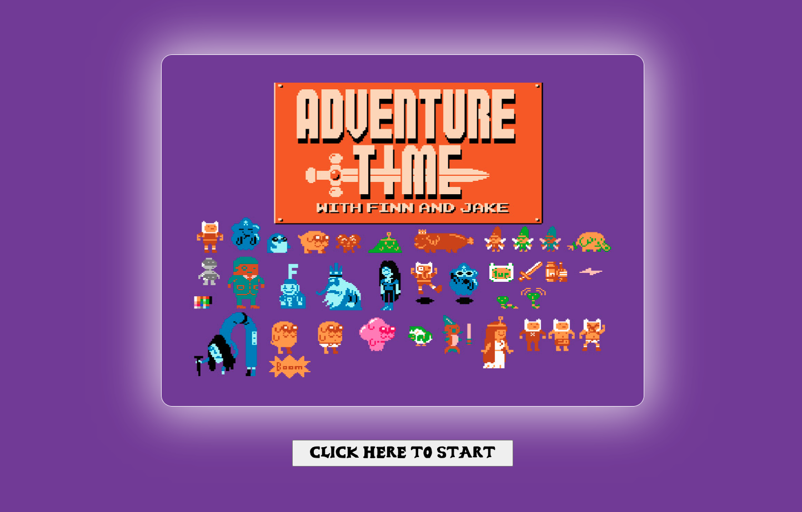
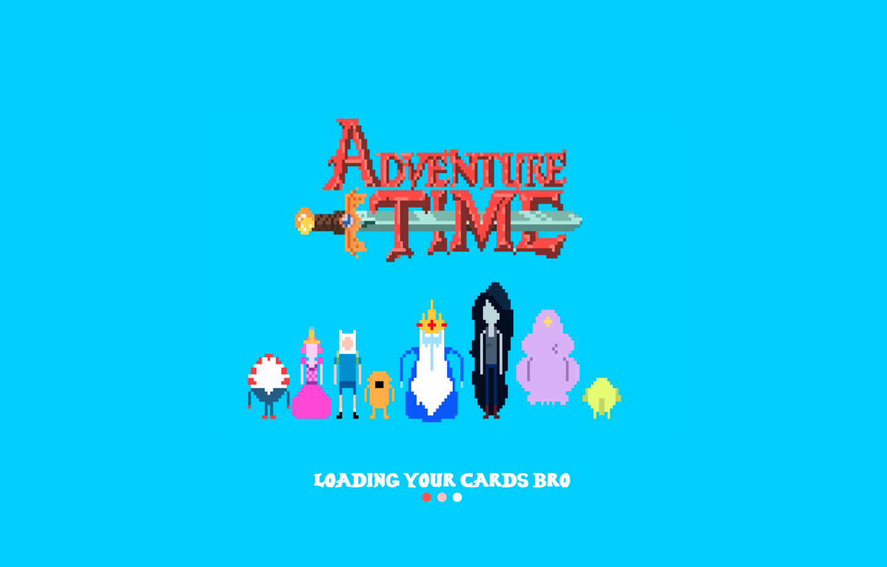
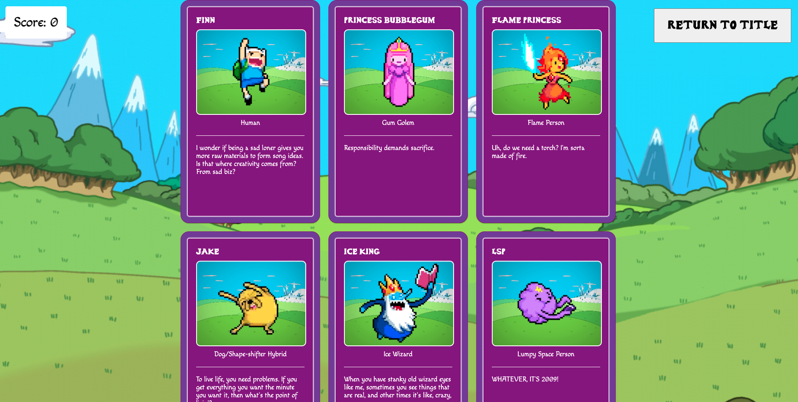
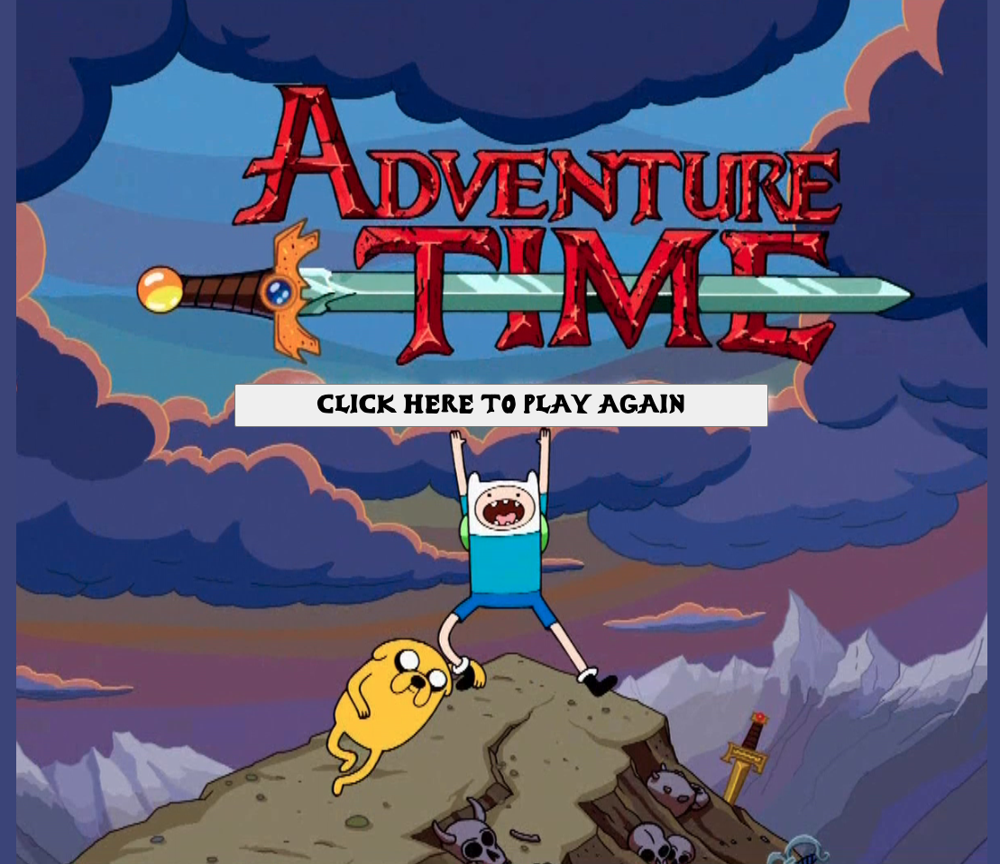

# Adventure Time Memory Game

## Creator
- Blain Crawford

A memorization game featuring an Adventure Time theme

## Deployed at

https://adventuretime-memory-game.netlify.app/

This project was a part of the <a href="https://www.theodinproject.com/">The Odin Project</a> curriculum

## Technologies used

- <a href='https://www.javascript.com/'>JavaScript</a>
- <a href="https://www.w3schools.com/css/">CSS</a>
- <a href='https://reactjs.org/'>React</a>
- <a href="https://mui.com/">Material UI</a>
- <a href='https://webpack.js.org/'>webpack</a>
- <a href='https://code.visualstudio.com/'>Visual Studio Code</a>
- <a href='https://github.com/blain-crawford'>Git/Github</a>
- <a href='https://babeljs.io/'>babel</a>
- <a href='https://prettier.io/'>Prettier</a>
- <a href='https://eslint.org/'>ESLint</a>
- <a href="https://axios-http.com/docs/intro">axios</a>

## Application functionality
- Load up application on netlify, or clone GitHub repository and use npm run build, and npm run server to build a "build" folder and deploy on loca server
- Enjoy opening 8bit Adventure Time theme song, and click play to send API request for cards
- Try to click each card only once to win the game!
- Upon sucessfully winning the game, enjoy click the play again button to go back to the title screen

## Title Screen:

## loading Screen:

## Game Board Screen:

## Winning Screen:
